# FloorScript Architecture

FloorScript is a TypeScript monorepo for programmatic generation of architectural floor plans from structured YAML/JSON configuration. It targets LLM AI agents as primary consumers, producing permit-ready residential floor plans.

## Table of Contents

- [Pipeline Overview](#pipeline-overview)
- [Package Structure](#package-structure)
- [Core Type System](#core-type-system)
- [Stage 1: Parsing](#stage-1-parsing)
- [Stage 2: Resolution](#stage-2-resolution)
- [Stage 3: SVG Rendering](#stage-3-svg-rendering)
- [Coordinate System](#coordinate-system)
- [Key Algorithms](#key-algorithms)
- [CLI](#cli)
- [Public API Surface](#public-api-surface)
- [Design Decisions](#design-decisions)

---

## Pipeline Overview

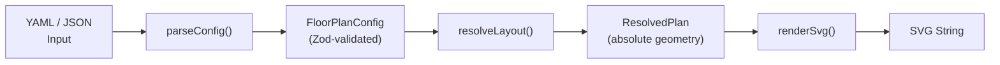

The entire system is a three-stage pipeline:

1. **Parse** — YAML or JSON input is validated against Zod schemas, producing typed `FloorPlanConfig`
2. **Resolve** — Configuration is transformed into absolute geometry (`ResolvedPlan`) with walls, openings, dimensions, and sub-spaces fully computed
3. **Render** — Geometry is coordinate-transformed (Y-up to Y-down) and rendered as layered SVG

Each stage is a pure function. Same input always produces same output.

---

## Package Structure

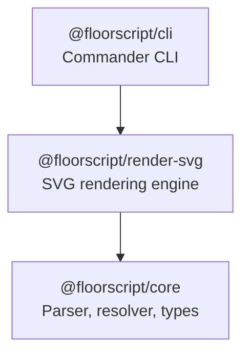

| Package | Role | Key Exports |
|---------|------|-------------|
| `@floorscript/core` | Parsing, layout resolution, types | `parseConfig`, `resolveLayout`, `parseDimension`, all config/geometry types |
| `@floorscript/render-svg` | SVG generation from resolved geometry | `renderSvg`, `SvgRenderOptions` |
| `@floorscript/cli` | Command-line interface | `render`, `validate`, `init` commands |

### Source Layout

```
packages/
  core/
    src/
      types/        Config interfaces (config.ts) + geometry types (geometry.ts)
      parser/       Config parser (Zod), dimension parser (imperial/metric)
      resolver/     Layout, wall, opening, dimension, enclosure, extension, composite outline
  render-svg/
    src/
      renderers/    Wall, door, window, dimension, label, electrical, plumbing, title block
      svg-document.ts           Lightweight SVG builder (no DOM)
      svg-drawing-context.ts    DrawingContext abstraction
      coordinate-transform.ts   Y-up → Y-down transform
      render-svg.ts             Orchestrator
  cli/
    src/
      commands/     render.ts, validate.ts, init.ts
```

---

## Core Type System

### Input Configuration Types

All input types live in `packages/core/src/types/config.ts` with companion Zod schemas. Types are inferred from schemas via `z.infer<typeof Schema>`.

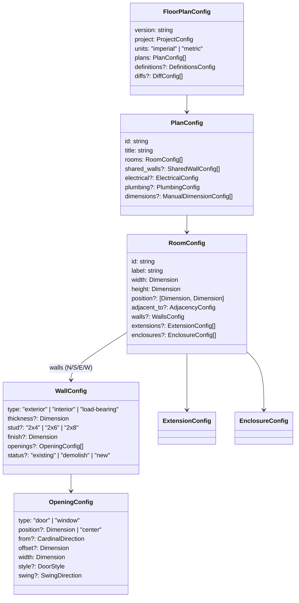

### Dimension Type

Dimensions can be strings or bare numbers:

| Format | Example | Parsed Value |
|--------|---------|-------------|
| Feet | `"12ft"` | 12.0 ft |
| Feet + inches | `"12ft 6in"` | 12.5 ft |
| Inches only | `"33in"` | 2.75 ft |
| Fractional inches | `"4ft 3-1/2in"` | 4.2917 ft |
| Meters | `"3.5m"` | 3.5 m |
| Millimeters | `"900mm"` | 0.9 m |
| Bare number | `12` | 12 (in plan's unit) |

### Room Positioning

Rooms can be positioned in two ways:

1. **Explicit position** — absolute `[x, y]` coordinates
2. **Adjacency** — relative to another room via `adjacent_to`

```yaml
# Explicit
position: ["0ft", "0ft"]

# Adjacent
adjacent_to:
  room: kitchen
  wall: east          # Attach to kitchen's east wall
  alignment: start    # Align bottom edges
  offset: "2ft"       # Shift 2ft north
```

### Composite Room Sub-Spaces

Rooms can contain **enclosures** (inward sub-spaces like closets) and **extensions** (outward bump-outs like bay windows):

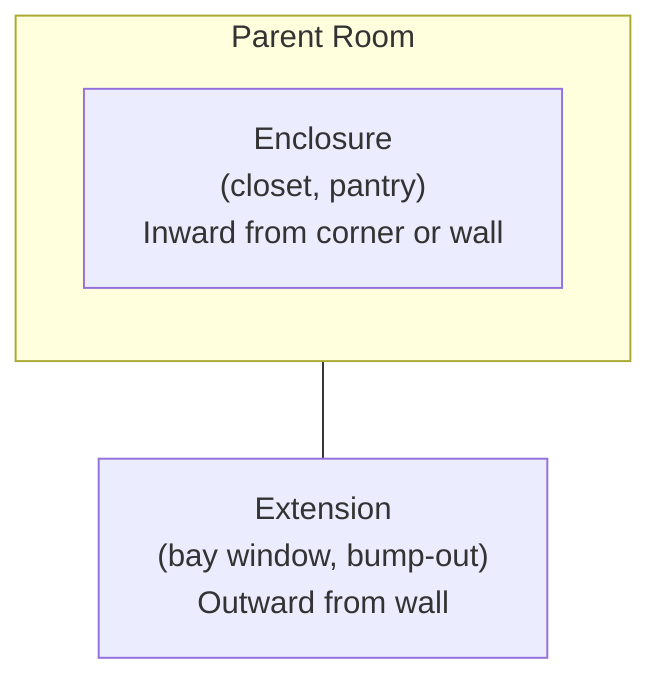

**Enclosures** have two placement modes:
- **Corner-based** — anchored to a room corner (`corner: "northwest"`)
- **Wall-based** — positioned along a wall (`wall: "north"`, `from: "west"`, `offset: "3ft"`)

**Extensions** always specify:
- `wall` — which parent wall to extend from
- `from`/`offset` — position along that wall
- `width`/`depth` — dimensions of the bump-out

### Resolved Geometry Types

Output types in `packages/core/src/types/geometry.ts`. All coordinates are absolute in canonical units (feet or meters).

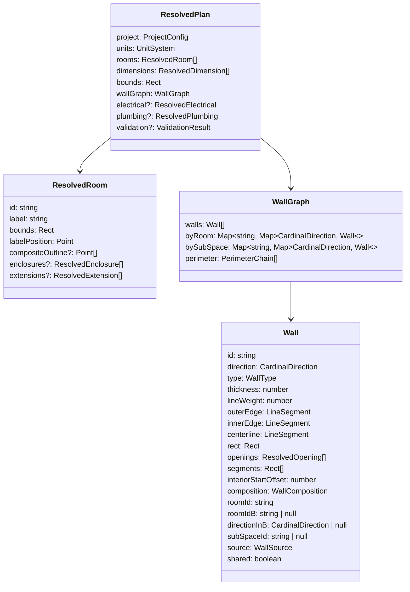

There is a single unified `Wall` type for all walls in the plan. The `source` field (`"parent"` | `"enclosure"` | `"extension"`) indicates where the wall originated. Rooms no longer carry their own `.walls` array — all walls live in the `WallGraph`.

**Key conventions:**
- `bounds` = room interior clear space (sheetrock-to-sheetrock)
- Walls extend **outward** from bounds
- `segments` = wall rectangles split around openings/gaps
- `compositeOutline` = union polygon for rooms with extensions/enclosures
- `wallGraph.byRoom` = lookup walls by room ID and direction
- `wallGraph.bySubSpace` = lookup walls by enclosure/extension ID and direction
- `wallGraph.perimeter` = computed building outline chains for rendering

---

## Stage 1: Parsing

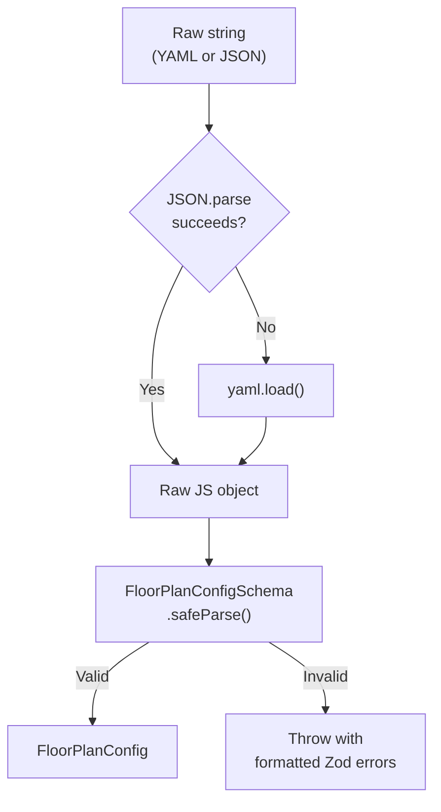

**Entry point:** `parseConfig(input: string): FloorPlanConfig`

1. **Format detection** — tries `JSON.parse` first, falls back to `yaml.load`
2. **Zod validation** — `FloorPlanConfigSchema.safeParse(raw)` validates the entire config tree
3. **Error formatting** — Zod issues are flattened into readable paths like `rooms.0.walls.north.type: Invalid enum value`

### Dimension Parsing

`parseDimension(value: Dimension, units: UnitSystem): number`

Uses ordered regex patterns (most-specific first) to parse imperial/metric dimension strings into canonical float values:

```
FT_IN_FRAC  →  /^(\d+)ft\s+(\d+)-(\d+)\/(\d+)in$/   (feet + fractional inches)
FT_IN       →  /^(\d+)ft\s+(\d+)in$/                  (feet + inches)
FT_ONLY     →  /^(\d+)ft$/                             (feet only)
IN_ONLY     →  /^(\d+)in$/                             (inches only)
METERS      →  /^(\d+)m$/                              (meters)
MILLIMETERS →  /^(\d+)mm$/                             (millimeters)
```

---

## Stage 2: Resolution

The resolver converts validated configuration into absolute geometry. This is the most complex stage.

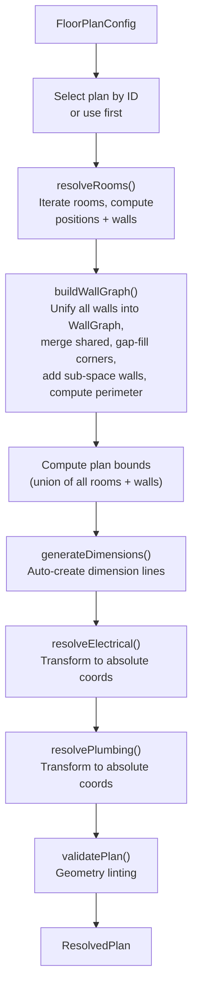

**Entry point:** `resolveLayout(config: FloorPlanConfig, planId?: string): ResolvedPlan`

### Per-Room Resolution

Each room goes through a detailed resolution process:

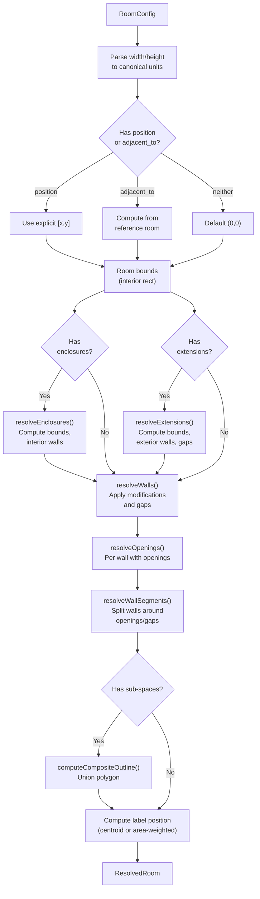

### Wall Resolution

**File:** `packages/core/src/resolver/wall-resolver.ts`

For each cardinal direction (N/S/E/W):

1. **Resolve thickness** — priority: explicit `thickness` > `stud` + `finish` composition > defaults by type
2. **Compute wall rectangle** — extends outward from room bounds
3. **Apply modifications** — enclosure wall shortening, extension gap splitting
4. **Compute edges** — inner edge (room face), outer edge, centerline

```
Wall Thickness Defaults:
  Exterior / Load-bearing:  2x6 stud + 0.5" drywall × 2 = 6.5"
  Interior:                 2x4 stud + 0.5" drywall × 2 = 4.5"
```

**Corner convention:** Horizontal walls (N/S) extend through corners to include perpendicular wall thickness. Vertical walls (E/W) butt into horizontal walls. This eliminates corner gaps.

```
  ┌──────────────────────┐  ← North wall extends full width
  │                      │     (includes east/west thickness)
  ║                      ║
  ║    Room Interior     ║  ← East/West walls butt into N/S
  ║                      ║
  │                      │
  └──────────────────────┘  ← South wall extends full width
```

### Opening Resolution

**File:** `packages/core/src/resolver/opening-resolver.ts`

Three mutually exclusive positioning modes:

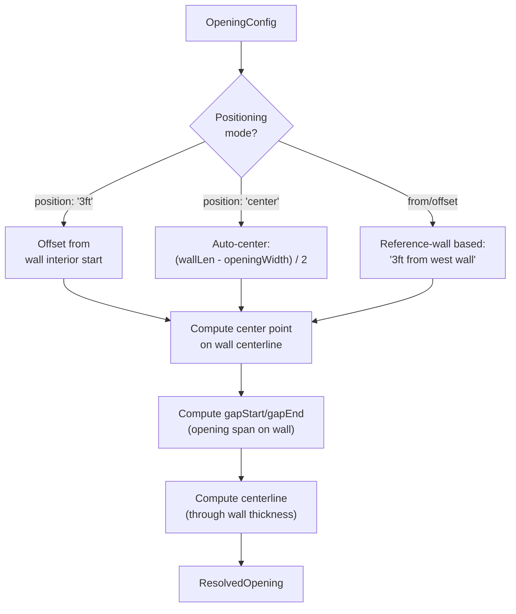

**From/offset mapping** — perpendicular wall names map to wall start/end:

| Wall Direction | Start | End |
|---------------|-------|-----|
| South / North | west | east |
| East / West | south | north |

`from: "west", offset: "3ft"` on a south wall means 3ft from the left (west) end.
`from: "east", offset: "3ft"` on a south wall means 3ft from the right (east) end.

### Wall Graph Construction

**File:** `packages/core/src/resolver/shared-wall-resolver.ts`

`buildWallGraph()` collects **all** walls in the plan — parent room walls (N/S/E/W), enclosure interior walls, and extension exterior walls — into a single unified `WallGraph`. This is the **sole source of truth** for all wall geometry at render time.

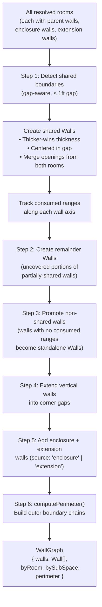

The result is that **every** wall in the plan — parent, shared, enclosure, and extension — ends up as a `Wall` entry in the graph. The `source` field distinguishes wall origin (`"parent"`, `"enclosure"`, `"extension"`), and `bySubSpace` enables lookups by enclosure/extension ID.

**Thicker-wins rule:** When two rooms share a wall, the thicker specification wins: `thickness = max(wallA.thickness, wallB.thickness)`. The shared wall is centered in the gap between rooms.

**Vertical wall gap-filling:** After all walls are promoted, vertical (E/W) walls are extended into corner gaps. If both rooms have walls on the same face, they meet at the gap centerline. If only one room has a wall, it extends to the full far edge.

### Unified Wall Rendering

All walls live in a single `plan.wallGraph.walls` array as `Wall[]`. The renderer iterates this array once in `renderWallGraph()` to draw every wall in the plan — parent room walls, shared walls, enclosure walls, and extension walls alike. There is no separate rendering path for sub-space walls.

| Wall Source | Example | Lookup |
|-------------|---------|--------|
| `"parent"` | Room's N/S/E/W walls (shared or standalone) | `wallGraph.byRoom.get(roomId)` |
| `"enclosure"` | Closet/pantry interior walls | `wallGraph.bySubSpace.get(enclosureId)` |
| `"extension"` | Bay window / bump-out exterior walls | `wallGraph.bySubSpace.get(extensionId)` |

The `wallGraph.perimeter` field contains `PerimeterChain[]` computed by `computePerimeter()`, which traces the outer boundary of the building for outline rendering.

### Enclosure Resolution

**File:** `packages/core/src/resolver/enclosure-resolver.ts`

Corner enclosures (e.g., closets in a room corner):

1. **Infer facing direction** — from explicit `facing`, or door wall inference, or default by corner
2. **Compute bounds** — `length` runs perpendicular to facing, `depth` runs in facing direction
3. **Generate interior walls** — 2 exposed edges get interior walls (4.5" thick)
4. **No parent wall modifications** — interior walls handle the boundary

Wall-based enclosures (e.g., closet along north wall):

1. **Compute position** — `from`/`offset` or centered, `length` can be `"full"` for entire wall
2. **Generate exposed-edge walls** — only edges not flush with parent corners get walls

### Extension Resolution

**File:** `packages/core/src/resolver/extension-resolver.ts`

1. **Compute position along parent wall** using `from`/`offset`
2. **Compute bounds outside parent room** (opposite direction from wall)
3. **Compute parent wall gap** (segment to remove)
4. **Generate 3 exterior walls** — far wall extends through corners, two perpendicular walls at standard bounds

```
Parent Room
┌─────────┬───────┬──────────┐
│         │  GAP  │          │  ← Parent north wall split by gap
│         │       │          │
│         ├───┬───┤          │
│         │   │   │          │
│         │ EXT   │          │  ← Extension bump-out (3 walls)
│         │   │   │          │
│         └───┘               │
│                            │
└────────────────────────────┘
```

### Dimension Resolution

**File:** `packages/core/src/resolver/dimension-resolver.ts`

Auto-generates width and height dimension lines for each room:

1. **Neighbor detection** — checks for adjacent rooms in each direction (gap-aware)
2. **Side selection** — width prefers south, height prefers west; flips if neighbor present
3. **Deduplication** — shared edges only get one dimension line
4. **Offset** — 2ft (imperial) or 0.6m (metric) from room edge

### Electrical & Plumbing Resolution

Wall-mounted elements (outlets, switches, plumbing fixtures) are resolved from wall references:

```yaml
# Config: reference a wall by "roomId.direction"
wall: "kitchen.south"
position: ["3ft", "1ft 6in"]   # [along wall, height]

# Enclosure and extension walls can also be referenced by "subSpaceId.direction"
wall: "pantry.south"
wall: "nook.north"
```

The resolver uses the `WallGraph` to find the referenced wall — looking up parent room walls via `byRoom` and enclosure/extension walls via `bySubSpace`. It computes a point on the wall's centerline at the specified offset from wall start and returns absolute coordinates.

Plumbing fixtures add depth-aware positioning: `offset: 0` places the fixture edge flush with the wall face (not the fixture center).

### Validation

**File:** `packages/core/src/resolver/validation.ts`

`validatePlan()` runs geometry checks after resolution:

| Check | Severity | Description |
|-------|----------|-------------|
| Overlapping openings | Error | Two openings on the same wall overlap |
| Opening exceeds wall | Error | Opening wider than wall interior |
| Sealed room | Warning | Room has no doors or windows |
| Sealed enclosure | Warning | Enclosure has no door |
| Opening in extension gap | Warning | Parent wall opening overlaps extension gap |
| Fixture out of bounds | Warning | Plumbing fixture outside all rooms |
| Run through wall | Warning | Supply/drain run crosses a wall |

---

## Stage 3: SVG Rendering

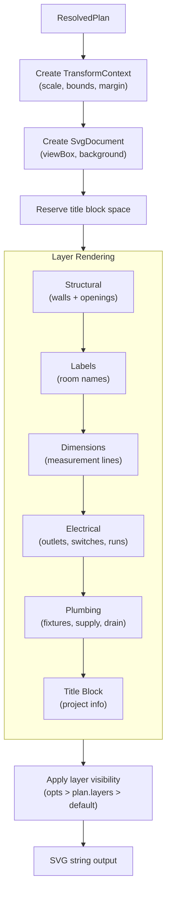

**Entry point:** `renderSvg(plan: ResolvedPlan, options?: SvgRenderOptions): string`

### SVG Document Structure

```xml
<svg xmlns="..." viewBox="0 0 {width} {height}">
  <style>...</style>
  <defs>...</defs>
  <rect fill="{background}" />           <!-- Background -->
  <g class="layer-structural">...</g>    <!-- Walls + openings -->
  <g class="layer-labels">...</g>        <!-- Room labels -->
  <g class="layer-dimensions">...</g>    <!-- Dimension lines -->
  <g class="layer-electrical">...</g>    <!-- Electrical symbols -->
  <g class="layer-plumbing">...</g>      <!-- Plumbing fixtures + runs -->
  <g class="layer-title-block">...</g>   <!-- Project metadata -->
</svg>
```

### Drawing Context

All renderers operate against a `DrawingContext` interface rather than emitting SVG directly. This allows future rendering backends (e.g., PDF).

```typescript
interface DrawingContext {
  openGroup(attrs): void;
  closeGroup(): void;
  rect(x, y, w, h, attrs?): void;
  line(x1, y1, x2, y2, attrs?): void;
  arc(x1, y1, radius, x2, y2, sweepFlag, attrs?): void;
  circle(cx, cy, r, attrs?): void;
  path(d, attrs?): void;
  text(x, y, content, attrs?): void;
  polygon(points, attrs?): void;
  getOutput(): string;
}
```

### Renderer Inventory

| Renderer | File | Renders |
|----------|------|---------|
| Wall | `wall-renderer.ts` | All wall segments in a single pass via `renderWallGraph()` (parent, shared, enclosure, extension) |
| Door | `door-renderer.ts` | Door leaf + swing arc, cased openings, sliding doors |
| Window | `window-renderer.ts` | Window symbol (double line through wall) |
| Dimension | `dimension-renderer.ts` | Extension lines, dimension line, arrows, text label |
| Label | `label-renderer.ts` | Room name + area text at label position |
| Electrical | `electrical-renderer.ts` | Panel, outlets, switches, light fixtures, smoke detectors, runs |
| Plumbing | `plumbing-renderer.ts` | Fixtures (toilet, sink, shower, tub), supply runs (red/blue), drain runs (green) |
| Title Block | `title-block-renderer.ts` | Project title, address, owner, date, scale |

### Door Swing Arc

Door rendering uses a cross-product technique to determine the SVG arc sweep flag, which is immune to the Y-flip coordinate transform:

```
cross = leafDx × swingDy - leafDy × swingDx
sweepFlag = cross > 0 ? 1 : 0
```

This works uniformly for all door orientations and swing directions without per-direction special-casing.

---

## Coordinate System

### Plan Space vs SVG Space

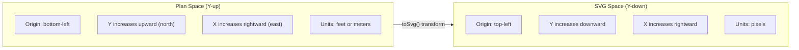

### Transform Functions

```typescript
// Point transform: Y-up → Y-down
function toSvg(point: Point, ctx: TransformContext): Point {
  return {
    x: (point.x - planBounds.x + margin) * scale,
    y: svgHeight - (point.y - planBounds.y + margin) * scale
  };
}

// Rect transform: bottom-left origin → top-left origin
function rectToSvg(rect: Rect, ctx: TransformContext) {
  const topLeft = toSvg({ x: rect.x, y: rect.y + rect.height }, ctx);
  return { x: topLeft.x, y: topLeft.y, width: rect.width * scale, height: rect.height * scale };
}
```

Steps: translate plan origin → add margin → scale to pixels → flip Y.

### Wall Geometry in Plan Space

```
     North (Y increases ↑)

     ┌──── North wall (extends outward, through corners) ────┐
     │  ┌──────────────────────────────────────────────┐  │
     │  │                                              │  │
  W  ║  ║              Room Interior                   ║  ║  E
  e  ║  ║            (bounds rect)                     ║  ║  a
  s  ║  ║                                              ║  ║  s
  t  │  │                                              │  │  t
     │  └──────────────────────────────────────────────┘  │
     └──── South wall (extends outward, through corners) ────┘

     Room bounds = interior clear space (sheetrock-to-sheetrock)
     Walls extend OUTWARD as additional material
     Horizontal walls include perpendicular wall thickness at corners
     Vertical walls butt into horizontal walls
```

---

## Key Algorithms

### Wall Composition Resolution

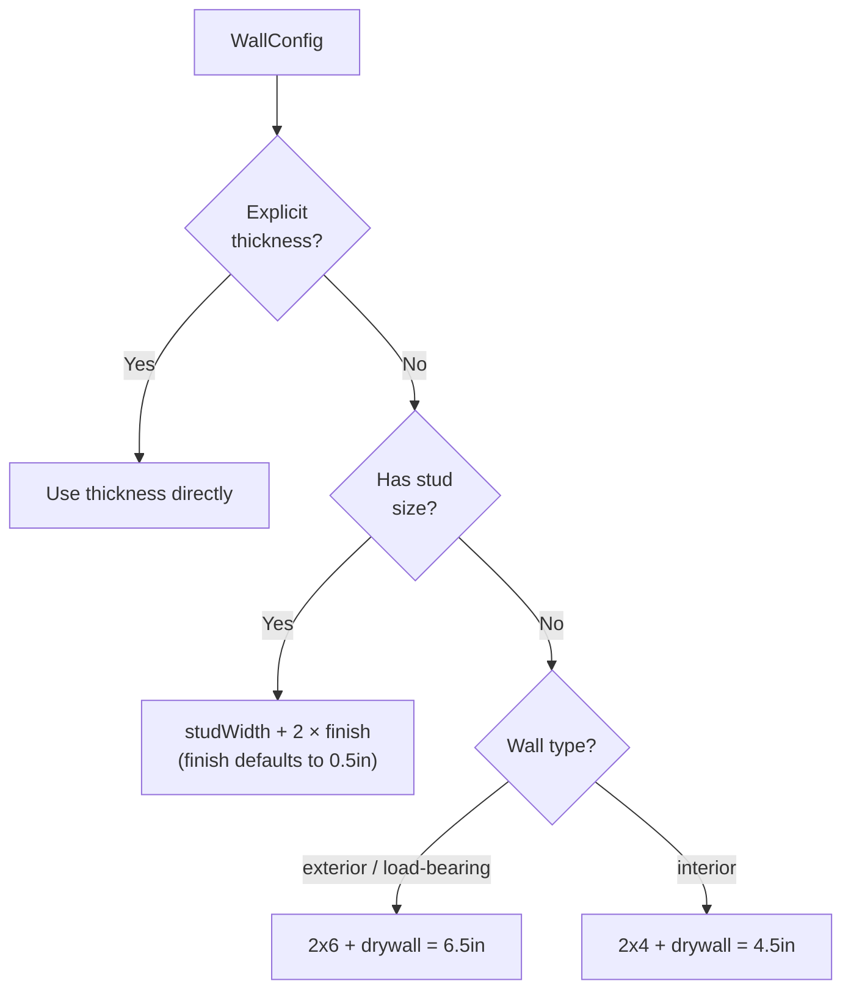

### Shared Wall Detection (Gap-Aware)

Two rooms share a wall when:
1. Their edges are separated by ≤ 1ft gap (any wall thickness fits)
2. They overlap along the perpendicular axis

The shared wall uses the **thicker-wins rule** (`max(A, B)`) and is **centered in the gap**.

### Coordinate-Compression Grid (Composite Outline)

For rooms with extensions or enclosures, a union polygon is computed:

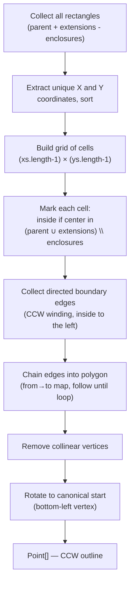

### Wall Segment Splitting

When a wall has openings or extension gaps, it is split into multiple rectangles:

```
 Before:  ┌────────────────────────────┐  (single wall rect)

 After:   ┌─────┐  ┌──────┐  ┌────────┐  (3 segments around 2 openings)
                 ^          ^
              opening    opening
```

Openings are sorted by position along the wall axis, then the wall rect is split at each gap.

### Vertical Wall Corner Gap-Filling

After shared walls are resolved, vertical walls may leave gaps at corners. The algorithm extends them:

- **Both rooms have walls** → extend to gap centerline (meet halfway)
- **Only one room has a wall** → extend to full far edge

---

## CLI

**Entry point:** `packages/cli/src/index.ts` (Commander)

### Commands

| Command | Usage | Description |
|---------|-------|-------------|
| `render` | `floorscript render <input> [-o file] [--plan id] [--width px]` | Parse → Resolve → Render → Write SVG |
| `validate` | `floorscript validate <input> [--plan id]` | Parse → Resolve → Validate → Print errors/warnings |
| `init` | `floorscript init [-t template]` | Generate starter YAML (templates: `single-room`, `kitchen-reno`) |

### Render Options

| Flag | Default | Description |
|------|---------|-------------|
| `-o, --output` | `<input>.svg` | Output file path |
| `--plan` | first plan | Plan ID to render |
| `--width` | 1200 | SVG width in pixels |
| `--no-dimensions` | — | Omit dimension lines |
| `--no-labels` | — | Omit room labels |
| `--no-title-block` | — | Omit title block |

---

## Public API Surface

### @floorscript/core

```typescript
// Parser
export { parseConfig } from "./parser/config-parser.js";
export { parseDimension, formatDimension } from "./parser/dimension.js";

// Resolver
export { resolveLayout } from "./resolver/layout-resolver.js";
export { validatePlan } from "./resolver/validation.js";

// Types (all config + geometry types)
export * from "./types/config.js";
export * from "./types/geometry.js";
```

### @floorscript/render-svg

```typescript
export { renderSvg } from "./render-svg.js";
export type { SvgRenderOptions } from "./render-svg.js";
```

---

## Design Decisions

### Walls Extend Outward

Room bounds represent interior clear space (sheetrock-to-sheetrock). Walls add thickness outside the room. This matches real-world construction and keeps room dimensions intuitive — a "12ft × 10ft" room is exactly that on the inside.

### Horizontal Walls Extend Through Corners

North/south walls span the full width including east/west wall thickness. East/west walls butt into them. This is a single consistent rule that eliminates corner gaps without special-case logic.

### Three Opening Positioning Modes

- **Numeric** (`position: "3ft"`) — precise control for programmatic use
- **Center** (`position: "center"`) — convenience shorthand
- **From/offset** (`from: "west"`, `offset: "3ft"`) — matches how humans describe placement ("3 feet from the west wall")

All modes reference the wall's interior length, not including wall thickness.

### Zod Schemas for All Input

Every input type has a corresponding Zod schema. Types are inferred via `z.infer<typeof Schema>`. This gives runtime validation with descriptive error messages and compile-time type safety from a single source of truth.

### Pure Functional Pipeline

All three pipeline stages are pure functions that return new objects without mutating inputs. `parseConfig`, `resolveLayout`, and `renderSvg` are all deterministic — same input always produces same output.

### DrawingContext Abstraction

SVG rendering goes through a `DrawingContext` interface rather than emitting SVG strings directly. This makes it possible to add other rendering backends (e.g., PDF via PDFKit) without changing any resolver or rendering logic.

### Linter-Style Validation

`validatePlan` returns both **errors** (geometry violations that would produce broken output) and **warnings** (best-practice suggestions). Warnings don't block rendering, giving users flexibility while surfacing potential issues.

### Coordinate-Compression for Composite Outline

Rather than expensive polygon boolean operations, composite outlines use a coordinate-compression grid that marks cells as inside/outside and chains boundary edges. This is O(n log n) and robust to arbitrary rectangle arrangements.

### No DOM Dependency

The SVG builder uses simple string concatenation. No browser runtime or DOM library is required, keeping the package lightweight and fast for server-side / CLI use.
