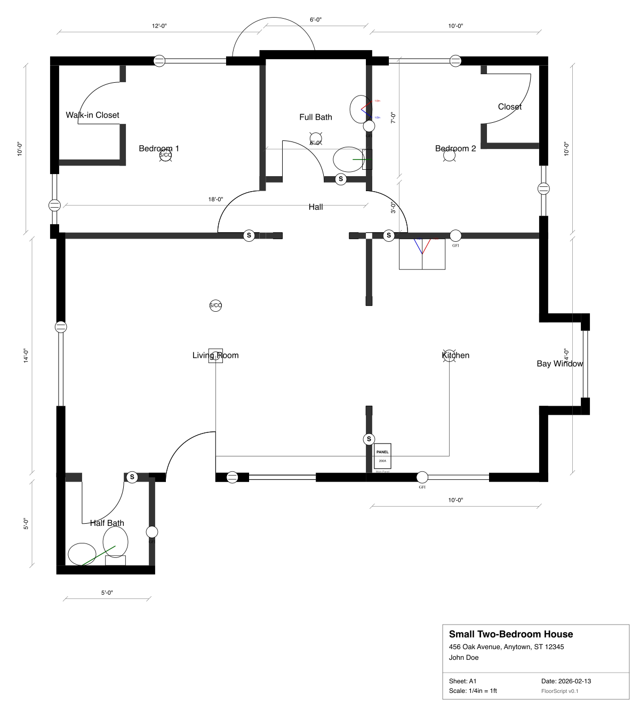

# FloorScript

**Floor plans as code.** A TypeScript library and CLI for generating architectural floor plans from YAML/JSON configuration — like Mermaid, but for floor plans.

<!-- badges -->
[](LICENSE)

## What It Looks Like

Define a floor plan in YAML:

```yaml
version: "0.1"
project:
  title: "Single Room"
  scale: "1/4in = 1ft"
units: imperial

plans:
  - id: main
    title: "Floor Plan"
    rooms:
      - id: room1
        label: "Living Room"
        position: [0, 0]
        width: 15ft
        height: 12ft
        walls:
          north: { type: exterior }
          south: { type: exterior }
          east:
            type: exterior
            openings:
              - type: window
                position: 3ft
                width: 6ft
          west:
            type: exterior
            openings:
              - type: door
                position: 4ft
                width: 3ft
                swing: inward-right
```

Render it:

```bash
floorscript render plan.yaml -o plan.svg
```

<p align="center">
  
</p>

## Features

- **YAML/JSON input** — Human-readable, version-controllable, LLM-friendly
- **Architectural conventions** — Correct line weights, door swings, window symbols, and dimension lines out of the box
- **Multi-room layouts** — Position rooms with explicit coordinates or adjacency helpers (`adjacent_to`)
- **Electrical systems** — Panels, outlets (duplex/GFCI), switches, fixtures, smoke detectors, circuit runs
- **Plumbing systems** — Toilets, sinks, supply runs (hot/cold), drain runs
- **Layer control** — Toggle structural, electrical, plumbing, and dimension layers independently
- **Validation** — Detects overlapping rooms, missing walls, and geometry errors before rendering
- **Renovation support** — Before/after plan pairs for demolition/construction diffing
- **Imperial & metric** — Full support for feet/inches (with fractions) and meters/mm
- **CLI + library** — Use from the command line or integrate programmatically in TypeScript/JavaScript

## Quick Start

### Install

```bash
npm install -g @floorscript/cli
```

### Create a config

```bash
floorscript init > my-plan.yaml
```

### Render

```bash
floorscript render my-plan.yaml -o my-plan.svg
```

## CLI Reference

### `floorscript render <input>`

Render a floor plan config to SVG.

```
Options:
  -o, --output <file>     Output file path (default: <input>.svg)
  --plan <id>             Plan ID to render (default: first plan)
  --width <px>            SVG width in pixels (default: 1200)
  --no-dimensions         Omit dimension lines
  --no-labels             Omit room labels
  --no-title-block        Omit title block
```

```bash
# Render specific plan at custom width
floorscript render house.yaml --plan existing --width 1600 -o existing.svg

# Minimal output — just walls and openings
floorscript render house.yaml --no-dimensions --no-labels --no-title-block
```

### `floorscript validate <input>`

Validate a config file for geometry errors (overlapping rooms, invalid openings, etc.).

```
Options:
  --plan <id>             Plan ID to validate (default: first plan)
```

```bash
floorscript validate house.yaml
# ✓ Plan is valid. No issues found.
```

### `floorscript init`

Generate a template floor plan config.

```
Options:
  -t, --template <name>   Template name (default: single-room)
                           Available: single-room, kitchen-reno
```

```bash
floorscript init > plan.yaml
floorscript init -t kitchen-reno > reno.yaml
```

## Library API

Use FloorScript programmatically with the three-stage pipeline:

```typescript
import { parseConfig, resolveLayout } from "@floorscript/core";
import { renderSvg } from "@floorscript/render-svg";
import { readFileSync, writeFileSync } from "node:fs";

// 1. Parse YAML/JSON config
const yaml = readFileSync("plan.yaml", "utf-8");
const config = parseConfig(yaml);

// 2. Resolve layout geometry
const resolved = resolveLayout(config);

// 3. Render to SVG
const svg = renderSvg(resolved, {
  width: 1200,
  showDimensions: true,
  showLabels: true,
  showTitleBlock: true,
});

writeFileSync("plan.svg", svg);
```

### Packages

| Package | Description |
|---------|-------------|
| `@floorscript/core` | Parser, layout resolver, types, validation |
| `@floorscript/render-svg` | SVG rendering engine |
| `@floorscript/cli` | Command-line interface |

### Render Options

```typescript
interface SvgRenderOptions {
  width?: number;        // SVG width in pixels (default: 1200)
  background?: string;   // Background color (default: "white")
  margin?: number;       // Margin in feet
  showDimensions?: boolean;  // Show dimension lines (default: true)
  showLabels?: boolean;      // Show room labels (default: true)
  showTitleBlock?: boolean;  // Show title block (default: true)
  layers?: Record<string, { visible: boolean; color_override?: string | null }>;
}
```

## YAML Configuration

### Rooms

Rooms are positioned with explicit coordinates or adjacency helpers:

```yaml
rooms:
  - id: living
    label: "Living Room"
    position: [0, 0]       # Explicit position in feet
    width: 15ft
    height: 12ft

  - id: kitchen
    label: "Kitchen"
    adjacent_to:            # Position relative to another room
      room: living
      wall: east
      alignment: end        # start, center, or end
    width: 12ft
    height: 10ft
```

### Walls & Openings

Each room defines four walls (north, south, east, west) with type and optional openings:

```yaml
walls:
  north: { type: exterior }
  south: { type: interior }
  east:
    type: exterior
    openings:
      - type: window
        position: 3ft         # Offset from wall start
        width: 4ft
  west:
    type: interior
    openings:
      - type: door
        position: 4ft
        width: 3ft
        swing: inward-right   # inward-left, inward-right, outward-left, outward-right
      - type: door
        style: cased-opening  # Open passage, no door leaf
        position: 1ft
        width: 6ft
```

### Electrical

```yaml
electrical:
  panel:
    position: [2ft, 10ft]
    amps: 200
    label: "Main Panel"
  outlets:
    - id: lr-out-1
      type: duplex          # duplex or gfci
      position: [5ft, 0]
      wall: living.south    # room.wall reference
      circuit: 1
  switches:
    - type: single           # single or three-way
      position: [8ft, 0]
      wall: living.west
      controls: [lr-light-1]
      circuit: 1
  fixtures:
    - id: lr-light-1
      type: recessed         # recessed or surface
      position: [7.5ft, 6ft]
      circuit: 1
  smoke_detectors:
    - position: [7.5ft, 10ft]
      type: combo
  runs:
    - circuit: 1
      path: [[2ft, 10ft], [2ft, 6ft], [7.5ft, 6ft]]
      style: solid
```

### Plumbing

```yaml
plumbing:
  fixtures:
    - id: bath-toilet
      type: toilet
      position: [2, -4.5]
      width: 18in
      depth: 28in
    - id: bath-sink
      type: bath-sink
      position: [5, -4]
      width: 20in
      depth: 16in
  supply_runs:
    - type: cold             # cold (blue) or hot (red)
      path: [[5, -4], [5, -1]]
      size: "1/2in"
  drain_runs:
    - path: [[2, -4.5], [2, -6]]
      size: "3in"
```

### Layers

Control which systems are rendered:

```yaml
layers:
  structural:
    visible: true
  electrical:
    visible: true
  plumbing:
    visible: true
  dimensions:
    visible: true
```

### Project Metadata

```yaml
version: "0.1"
project:
  title: "Kitchen Renovation - 123 Main St"
  address: "123 Main Street, Anytown, ST 12345"
  owner: "Jane Smith"
  date: "2026-02-11"
  sheet: "A1"
  scale: "1/4in = 1ft"
units: imperial   # or metric
```

## Examples

The [`examples/`](examples/) directory contains complete, runnable configs:

| Example | Description |
|---------|-------------|
| [`single-room.yaml`](examples/single-room.yaml) | Minimal single room with a door and window |
| [`multi-room.yaml`](examples/multi-room.yaml) | Multi-room layout with electrical, plumbing, and adjacency |
| [`kitchen-reno.yaml`](examples/kitchen-reno.yaml) | Kitchen renovation with before/after plans |

## Architecture

```
Input (YAML/JSON) → parseConfig → resolveLayout → renderSvg → SVG
```

```
packages/
  core/           # @floorscript/core — Parser, resolver, types
  render-svg/     # @floorscript/render-svg — SVG rendering engine
  cli/            # @floorscript/cli — CLI (depends on render-svg → core)
```

The processing pipeline has three stages:

1. **Parse** — Validates input against Zod schemas, normalizes dimensions
2. **Resolve** — Computes absolute room positions, wall segments, opening geometry, electrical/plumbing coordinates
3. **Render** — Transforms resolved geometry into SVG with coordinate flipping (Y-up to Y-down) and architectural drawing conventions

## Development

```bash
pnpm install              # Install dependencies
pnpm build                # Build all packages
pnpm test                 # Run tests (vitest)
pnpm typecheck            # Type-check all packages
```

## License

[MIT](LICENSE) &copy; Jason Yeomans
